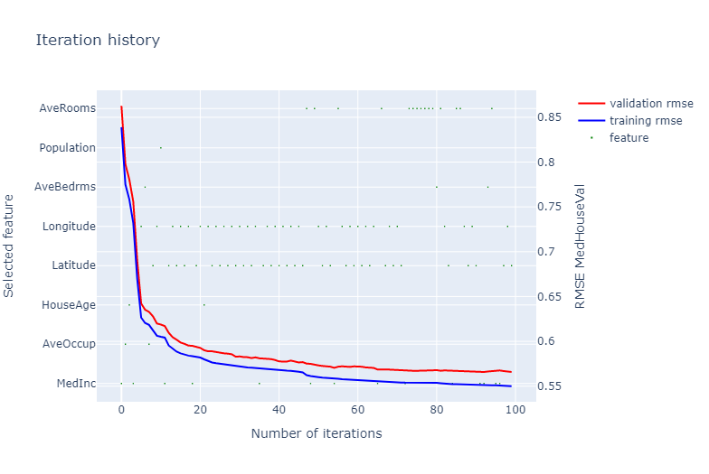
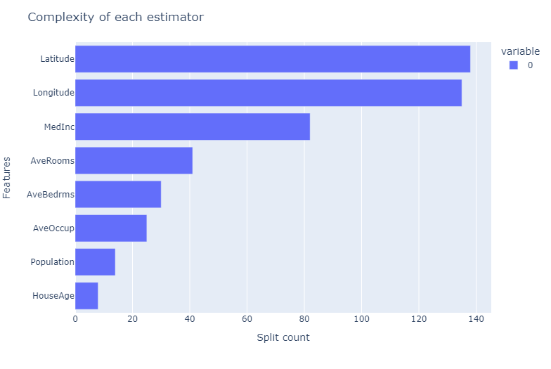
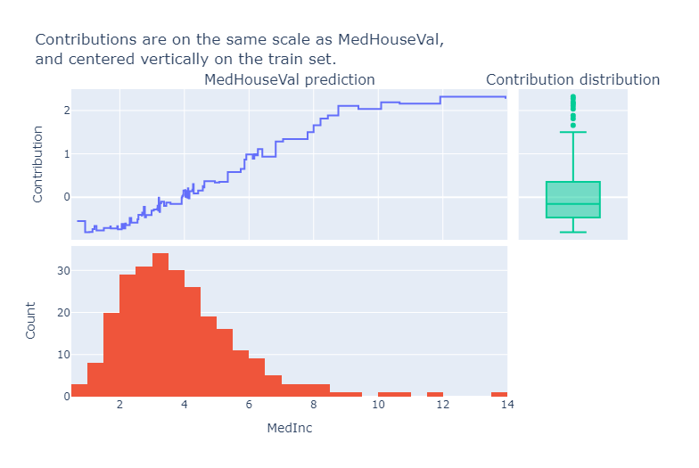

# AdditiveSparseBoostRegressor

This repository holds the implementation for an additive regressor, i.e.:

```math
y\approx f(x) = \beta + \sum_{i=1}^M f_i(x_i)
```

Where $f_i$ functions with zero-mean and $\beta$ is the intercept,
both parameters are estimated by minimizing the squared error loss function.

The functions $f_i$ are either a piecewise constant function (trained as ensemble of decision trees),
or the trivial zero-function, that is to say,
some features are ignored, making the regressor sparse.

This is achieved by combining the boosting algorithm with a
modification of mRMR (minimum Redundancy Maximum Relevance) feature selection at
each boosting iteration.

# Installation

The package can be installed with pip:

```bash
pip install git+https://github.com/thesis-jdgs/additive-sparse-boost-regression.git
```

**Note:** The package is not yet available on PyPI.

# Usage

The regressor is implemented in `asboostreg.py`,
and implements the familiar `fit` and `predict` methods from scikit-learn.:

```python
from asboostreg import SparseAdditiveBoostingRegressor
from sklearn.datasets import load_boston

X, y = load_boston(return_X_y=True)
sparsereg = SparseAdditiveBoostingRegressor(
    learning_rate=0.01,
    n_estimators=10_000,
    l2_regularization=2.0,
    max_depth=6,
    row_subsample=0.632,
    random_state=0,
    n_iter_no_change=30,
)
sparsereg.fit(X, y)
y_pred = sparsereg.predict(X)
```

To inspect the general characteristics of the model,
the `plot_model_information` method creates a plotly figure:

```python
sparsereg.plot_model_information()
```
Which creates a figure of the iteration history and model complexity for each feature,
like the following:




To inspect the predictions for a dataset `X`, you can use `explain(X)`:

```python
sparsereg.explain(X)
```
Which creates a figure of the mean importances of each feature,
and a plot of the 1D regressor for each selected feature:




We can also decompose the predictions into the additive components,
with the `contribution_frame` method:

```python
sparsereg.contribution_frame(X)
```
Which returns a pandas DataFrame with the additive components for each feature.
